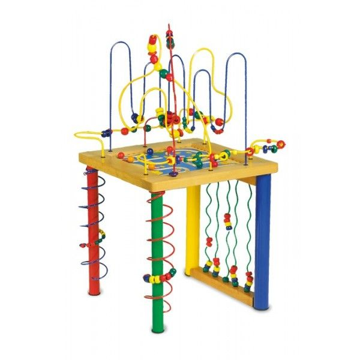
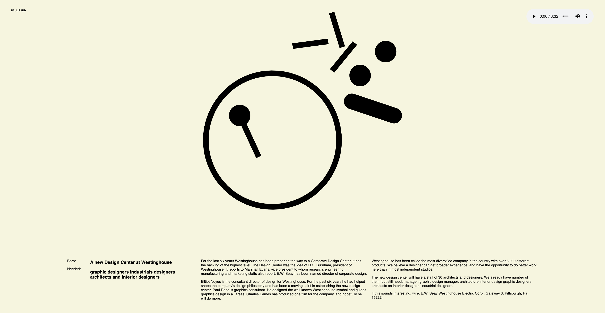

# web animatie

De link naar mijn page: https://kayaskov.github.io/web-animatie/

## De opdracht
Bij de Minor Visual Interface Design aan de Hogeschool van Amsterdam werd mij gevraagd om voor het vak Web Animaties een kunstwerk naar keuze te animeren door middel van HTML/CSS en een beetje Javascript.

## Het kunstwerk
Ik heb voor deze opdracht gekoven voor een advertentie ontworpen door Paul Rand in 1962. Het was een advertentie voor verschillende designers voor het buro Westinghouse in de US wat toen net ging beginnen. Paul Rand was de eerste designer die er was aangenomen en mocht dus de advertentie maken. Ik vind de stijl van Paul Rand super interessant.

Link naar het orginele kunstwerk: http://oa.letterformarchive.org/item?workID=lfa_rand_0092&LFAPics=Yes

Het werk deed, voornamelijk door de kleur en vormen, mij denken aan van de tafels die bij de tandarts staan voor kinderen met van de gekleurde stalen buizen en kralen: een motoriek tafel. Het leek mij leuk om de gebruiker van mijn website uit te dagen om uit te zoeken wat er allemaal voor mogelijkheden zijn op de pagina.

## De interacties

### Desktop:
* Wanneer de pagina opstart verschijnt de grote cirkel door een soort van load effect in beeld. Dit heb ik gedaan door een stroke-dasharray en stroke-dashoffset met een animatie te maken.
* Een mp3 play control staat rechts boven in de hoek. Ik heb gekozen voor een liedje van the Kinks die in 1962 hoog in de playlist stond. Dit is geen animatie maar vond ik wel leuk om erbij toen voor de "motoriek tafel". Het helpt ook mee het gevoel van de vormgeving over te brengen.
* hover over svg elementen kleur
* hover over svg elementen dashed
* hover over Paul Rand light
* elke toets: donkere achtergrond
* klikken op elementen change background color
* klikken op drum = golven
* verschillende mouse pointers
* grid voor de tekst

### Mobiel
* Door een media query papier achtergrond
* tekst verdwijnt 

