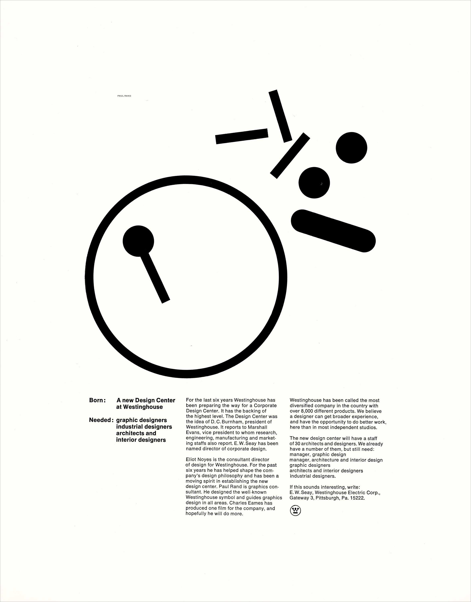

# Web Animatie

De link naar mijn page: https://kayaskov.github.io/web-animatie/

## De Opdracht
Bij de Minor Visual Interface Design aan de Hogeschool van Amsterdam werd mij gevraagd om voor het vak Web Animaties een kunstwerk naar keuze te animeren door middel van HTML/CSS en een beetje Javascript.

## Het Kunstwerk
Ik heb voor deze opdracht gekoven voor een advertentie ontworpen door Paul Rand in 1962. Het was een advertentie voor verschillende designers voor het buro Westinghouse in de US wat toen net ging beginnen. Paul Rand was de eerste designer die er was aangenomen en mocht dus de advertentie maken. Ik vind de stijl van Paul Rand super interessant.

Link naar het orginele kunstwerk: http://oa.letterformarchive.org/item?workID=lfa_rand_0092&LFAPics=Yes

Het werk deed, voornamelijk door de kleur en vormen, mij denken aan van de tafels die bij de tandarts staan voor kinderen met van de gekleurde stalen buizen en kralen: een motoriek tafel. Het leek mij leuk om de gebruiker van mijn website uit te dagen om uit te zoeken wat er allemaal voor mogelijkheden zijn op de pagina.

## De Interacties

### Desktop:
* Wanneer de pagina opstart verschijnt de grote cirkel door een soort van load effect in beeld. Dit heb ik gedaan door een stroke-dasharray en stroke-dashoffset met een animatie te maken.
* Wanneer je over verschillende elementen van de svg hovert krijg je verschillende kleuren te zien. Ik heb de kleuren gebruikt die Paul rand in zijn andere werken gebruikt heeft.
* Wanneer je over het "drumstickje" en de "ovaal" heen hovert zie je een bwegende stippellijn. Dit heb ik gedaan met een stroke-dasharray. Bij de ovaal heb dit met een borderradius en grote dashes gedaan en bij het stokje van de drumstick met kleine dashes en deze heb ik ook sneller laten gaan.
* Wanneer je over de naam van Paul Rand hovert (links bovenin) dan wordt het font light en de kleur rood.
* Wanneer je op een random key drukt wordt de achtergrond een soort van metaal achtig effect met een donkere kleur. 
* Wanneer je op verschillende delen van de svg klikt krijgt je verschillende achtergrond kleuren.
* Wanneer je op de drumstick klikt krijgt de background golven
* Ik heb de mouse pointers overal veranderd om nog een extra dementie te geven met bv. cursor: e-resize;.
* De tekst heb ik in grid in colommen verdeeld zodat het overeen komt met het kunstwerk.
* Een mp3 play control staat rechts boven in de hoek. Ik heb gekozen voor een liedje van the Kinks die in 1962 hoog in de playlist stond. Dit heb ik erbij gedaan om het idee van de "motoriek tafel" te versterken. Het helpt ook mee het gevoel van de vormgeving over te brengen door de ouderwetse vibes.

### Mobiel
* Door een media query heb ik bij mobiel een notitieblok achtige achtergrond toegevoegd. Door blauwe lijnen in de background te zetten.
* Als laatste heb ik de tekst op kleinere schermen laten verdwijnen omdat ik het niet nodig vond dat je moet scrollen voor de tekst. 

## Bronnen

* SVG lijn animatie: https://css-tricks.com/svg-line-animation-works/
* achtergronden: https://leaverou.github.io/css3patterns/
